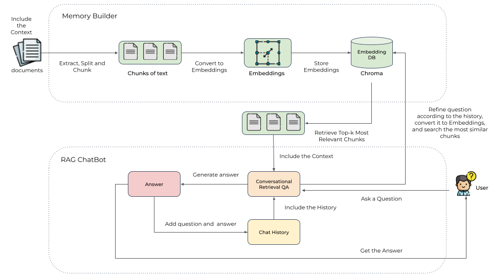

# RAG (Retrieval-augmented generation) ChatBot

<a target="_blank" href="https://colab.research.google.com/github/WTeam2024/rag_chatbot/blob/main/chatbot_WTeam.ipynb">
  
</a>

> [!IMPORTANT]
> The code has been tested on `Google Colab` running with a T4 GPU. 
> So far, there is no way to use only the CPU.
> If you are using another Operating System or different hardware, you can try to run it anyway.

> [!WARNING]
> It's important to note that the large language model sometimes generates hallucinations or false information. Especially when the amount of information is limited.

## Introduction

A RAG (Retrieval-Augmented Generation) chatbot combines retrieval-based and generative AI methods to provide accurate and contextually relevant responses. It leverages a database to fetch pertinent information and then uses a language model to generate coherent answers. This makes it effective for tasks requiring up-to-date or specific information. Read more information on it in AWS [documentation](https://aws.amazon.com/what-is/retrieval-augmented-generation/?nc1=h_ls).

There are many ways to build a RAG chatbot, we will all use open source tools such as:
-   [Google Colab](https://colab.google/);
-   [Hugging Face](https://huggingface.co/);
-   [LangChain](https://www.langchain.com/);
-   [Chroma](https://github.com/chroma-core/chroma);
-   [PyPDF](https://pypdf.readthedocs.io/en/stable/);
-   [Gradio](https://www.gradio.app/);
-   And so on...

The RAG Chatbot works by taking a collection of Markdown (or PDFs, or text file, or other files types) files as input and, when asked a question, provides the corresponding answer based on the context provided by those files.

An example of architecture can be:



When a user asks a question, the RAG ChatBot retrieves the most relevant parts from the embedding database (in our case ChromaDB).
Since the original question may not always be optimal for the LLM to retrieve, we first ask an LLM to rewrite the question,
then perform a retrieval-assisted reading.
The most relevant parts are then used as context to generate the final answer using a local language model (LLM).
In addition, the chatbot is designed to remember previous interactions. It stores the chat history and considers the
relevant context from previous conversations to provide more accurate answers.

## About the components

As LLM we chose to use *LLaMAntino-3-ANITA-8B-Inst-DPO-ITA*:
- the model is an instruction-tuned version of **Meta-Llama-3-8b-instruct** (a fine-tuned *LLaMA3* model);
- this model version aims to be the a Multilingual Model 🏁 (EN 🇺🇸 + ITA🇮🇹) to further fine-tuning on Specific Tasks in **Italian**;
- wants to provide Italian NLP researchers with an improved model for the Italian Language 🇮🇹 use cases.

See the [Github Page](https://github.com/marcopoli/LLaMAntino-3-ANITA). Details on [Hugging Face](https://huggingface.co/swap-uniba/LLaMAntino-3-ANITA-8B-Inst-DPO-ITA)!

Citation:

```bibtex
@misc{polignano2024advanced,
      title={Advanced Natural-based interaction for the ITAlian language: LLaMAntino-3-ANITA}, 
      author={Marco Polignano and Pierpaolo Basile and Giovanni Semeraro},
      year={2024},
      eprint={2405.07101},
      archivePrefix={arXiv},
      primaryClass={cs.CL}
}
```

```bibtex
@misc{basile2023llamantino,
      title={LLaMAntino: LLaMA 2 Models for Effective Text Generation in Italian Language}, 
      author={Pierpaolo Basile and Elio Musacchio and Marco Polignano and Lucia Siciliani and Giuseppe Fiameni and Giovanni Semeraro},
      year={2023},
      eprint={2312.09993},
      archivePrefix={arXiv},
      primaryClass={cs.CL}
}
```

```bibtex
@article{llama3modelcard,
  title={Llama 3 Model Card},
  author={AI@Meta},
  year={2024},
  url = {https://github.com/meta-llama/llama3/blob/main/MODEL_CARD.md}
}
```


As Embedding Model we chose *paraphrase-multilingual-MiniLM-L12-v2*:
- This is a sentence-transformers model: It maps sentences & paragraphs to a 384 dimensional dense vector space and can be used for tasks like clustering or semantic search.
- Based on 118M params.

See the [Paper](https://arxiv.org/abs/1908.10084) and the [Hugging Face](https://huggingface.co/sentence-transformers/paraphrase-multilingual-MiniLM-L12-v2) Page.

## How to use?

In order to use our chatbot:
- Upload in your Google Drive account the PDFs that you want to use inside a folder name `documents_colab`;
- Open the code in a Google Colab environment with a GPU Runtime;
- Set the `HF_TOKEN` secret (you need an Hugging Face account);
-  Run the code and go at the end. You will find a Gradio link to the UI;
-  Enjoy it!

> [!WARNING]
> Our chatbot will only recognize PDFs.
